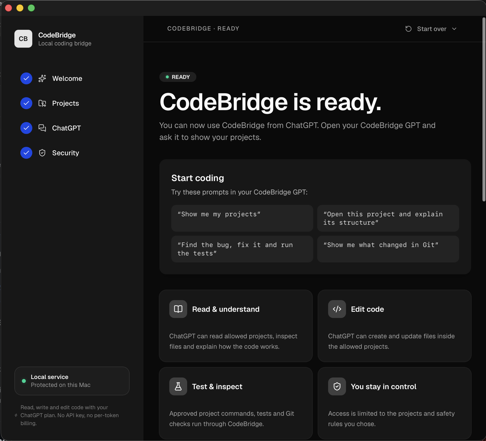

# CodeBridge

**Code on your Mac from a normal ChatGPT subscription — no API key, no per-token billing, no developer setup.**

CodeBridge is a small macOS app that gives a custom GPT safe, controlled access to project folders you explicitly choose. You pick the folders. ChatGPT reads, writes, edits and runs approved commands inside them. Nothing else on your Mac is reachable.

The model is your existing ChatGPT plan. CodeBridge never asks for an OpenAI API key and adds no usage cost of its own.

### [⬇ Download CodeBridge for macOS](https://github.com/jobbsystemrapporter/codebridge/releases/download/v0.2.0-beta.2/CodeBridge-0.2.0-beta.2.dmg)

`v0.2.0-beta.2` · 91.0 MB · universal (Apple Silicon + Intel) · macOS 14 or newer · [how to install](#install)



> **Beta.** The app, the Custom GPT Action bridge, the workspace policy and the execution chain are implemented, tested, and verified end to end against a real custom GPT. See [Status and limitations](#status-and-limitations) before relying on it.

---

## What you can do

Once connected, you talk to your GPT normally:

| You ask | CodeBridge does |
| --- | --- |
| *"Show me my projects"* | Lists only the folders you allowed |
| *"Open this project and explain its structure"* | Opens the project and reads its `AGENTS.md` / `CLAUDE.md` instructions |
| *"Find the bug, fix it and run the tests"* | Edits files in place, then runs the test command after you approve it |
| *"Show me what changed in Git"* | Reports branch and working-tree status |

Changes land in your real files. If you would rather keep them separate, CodeBridge can create an isolated Git worktree so the GPT's work never touches your project until you apply it.

## Requirements

- macOS 14 or newer, Apple Silicon or Intel
- A ChatGPT plan that can create custom GPTs
- A free [ngrok](https://ngrok.com) account, for the secure address between ChatGPT and your Mac

You do **not** need Node.js, Homebrew, Xcode, an ngrok CLI, or Terminal. The app bundles everything it uses.

## Install

1. [Download the DMG](https://github.com/jobbsystemrapporter/codebridge/releases/download/v0.2.0-beta.2/CodeBridge-0.2.0-beta.2.dmg) and open it.
2. Drag **CodeBridge.app** to Applications.
3. Open CodeBridge from Applications.

CodeBridge is a standalone app and is not registered with Apple, so macOS blocks the first launch. This is expected and is a one-time step:

- **macOS 15 and newer:** try to open it, then go to **System Settings → Privacy & Security**, scroll down, and click **Open Anyway** next to the CodeBridge message.
- **macOS 14:** right-click CodeBridge.app → **Open** → **Open**.

## Set up

**[→ Full step-by-step setup guide](docs/setup.md)** — every step with the exact
values to copy, plus troubleshooting.

The app walks you through the same steps, one at a time:

1. **Choose project folders.** Only these become reachable. Sensitive locations (SSH keys, cloud credentials, Keychains, Mail) are refused even if something asks for them.
2. **Connect securely.** Paste your ngrok connection code and your free reserved domain. CodeBridge starts the HTTPS address itself and stores the code in your Keychain. The reserved domain is what keeps the address the same across restarts.
3. **Create the custom GPT.** CodeBridge generates the GPT instructions, the Action schema and a private connection secret, and shows you exactly where each one goes in the ChatGPT editor.
4. **Test the connection.** When a real authenticated call from ChatGPT reaches your Mac, and not before, the app says Ready.

CodeBridge keeps running in the background after you close the window, so your GPT stays connected.

## How it works

```text
Your ChatGPT subscription
        │
Custom GPT you create in ChatGPT
        │
GPT Action (OpenAPI schema)
        │
Bearer authentication — a secret unique to your installation
        │
Public HTTPS address (ngrok)
        │
CodeBridge on your Mac
        ├── allowed folders only
        ├── AGENTS.md / CLAUDE.md project instructions
        ├── approvals for risky commands
        ├── audit log of every action
        ├── signed, short-lived execution capabilities
        ├── native execution helper (no shell)
        └── optional Git worktrees
        │
Your project files
```

ChatGPT is the AI. CodeBridge is the bridge and the gatekeeper — the security decisions are enforced by CodeBridge itself, not by instructions in a prompt that a model could be talked out of.

The public address exposes **only** the authenticated `/actions/*` surface. The local admin API, the optional MCP endpoint and the app's own interface stay on `127.0.0.1` and are never published through the tunnel.

## Security model

CodeBridge is deny-by-default. Choosing one project does not grant access to the rest of your Mac.

- **Paths** are canonicalised before authorisation, so symlinks cannot escape an allowed folder.
- **Commands** run through a native helper without a shell. The executable must be a bare command name from a fixed allowlist; anything else is refused by both the app and the helper.
- **Approvals** are bound to the exact command you were shown. An approval cannot be reused for a different one.
- **The local API** requires a per-installation secret and pins the `Host` header to loopback, so a web page cannot reach it by DNS rebinding.
- **Git worktrees** isolate workflow and review. They are not an OS-level sandbox, and CodeBridge does not claim to be a VM or container.

Full details and the exact boundary: [SECURITY.md](SECURITY.md).

## Removing CodeBridge

In the app, open **Start over**:

- **Erase all data & start fresh** — deletes all local CodeBridge state (configuration, project list, secrets, logs, workspaces) and returns to first-run setup.
- **Uninstall CodeBridge** — erases all state, unloads the background service, removes the launch agent and moves the app to the Trash.

Your project folders are never modified or deleted by either option.

## Status and limitations

Honest about where the beta stands:

- The app is **ad-hoc signed**, not notarised by Apple. Every user clears the one-time Gatekeeper block described above.
- The onboarding guide uses **illustrations, not real ChatGPT screenshots**, so labels may drift as ChatGPT's editor changes.
- The public address comes from ngrok. Reserve the free domain the app asks for — without it the address changes on every restart and the custom GPT has to be re-pointed.
- The guide is **English only**. If your ChatGPT is set to another language, the control names you see will differ from the ones in the guide.
- A **legacy free-form shell path** exists for development. It is disabled in Safe mode and should stay off for ordinary users.
- Execution capabilities are signed and short-lived, but **replay within the capability's TTL is not yet rejected**.

## Building from source

Requires macOS 14+, Node.js 20+ and Swift 6.

```sh
cd ui && npm install && npm run build   # renderer → src/public/
npm test                                 # core, action bridge, security regressions
./scripts/release.sh                     # full gate: build, test, package .app + DMG, verify
```

`scripts/release.sh` builds universal binaries, runs the execution end-to-end test, packages the app and DMG, verifies signatures and checksums, and runs the privacy scan.

### Layout

```text
src/        the modules the app runs, plus the built renderer in src/public/
test/       test suites and release gates — never bundled into the app
scripts/    build, packaging and launch-agent install scripts
native/     the macOS app (SwiftUI shell + WKWebView)
native-helper/  the execution helper that runs commands without a shell
ui/         renderer source (Vite + React + Tailwind v4 + Radix)
```

Architecture and contribution rules live in [AGENTS.md](AGENTS.md), which is the binding contract for changes.

## Documentation

- [docs/setup.md](docs/setup.md) — full setup guide, from download to first request
- [SECURITY.md](SECURITY.md) — security model and reporting
- [SUPPORT.md](SUPPORT.md) — getting help, filing bugs
- [CONTRIBUTING.md](CONTRIBUTING.md) — contribution rules
- [ROADMAP.md](ROADMAP.md) — what is done and what is next
- [CHANGELOG.md](CHANGELOG.md) — release history

## License

[MIT](LICENSE)
